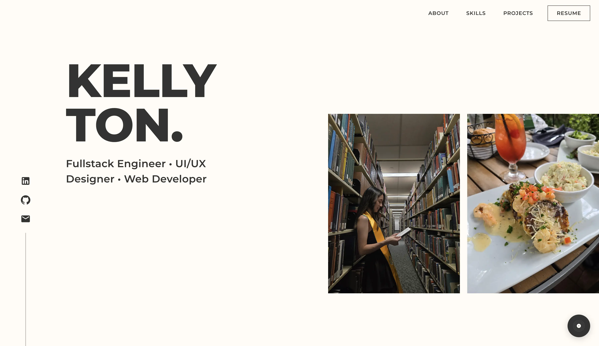
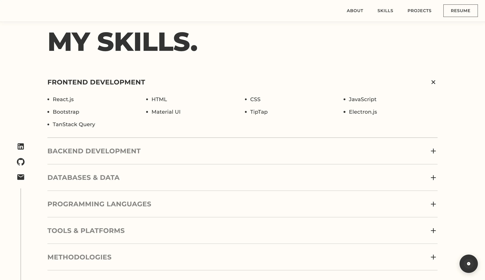
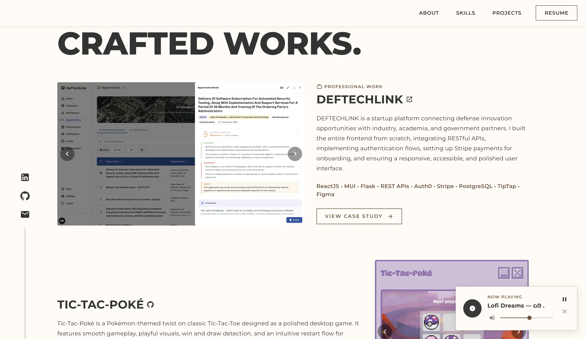
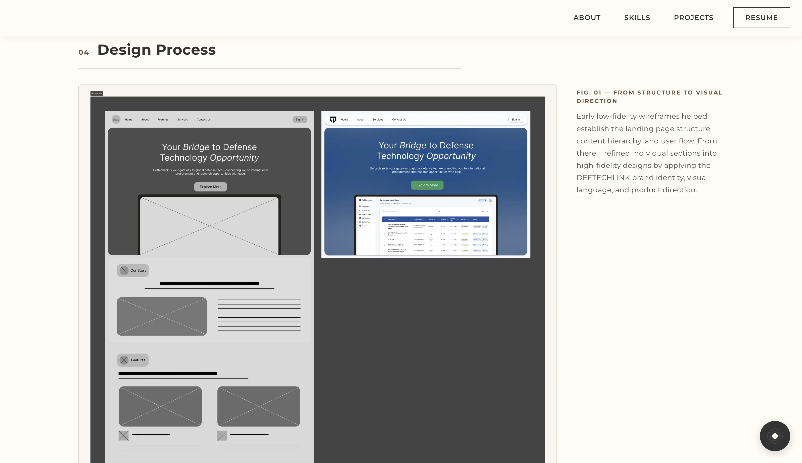

<div align="center">

# ☕ Kelly Ton · Portfolio

### A clean, modern personal portfolio built with React 19 & Vite 7, designed and developed from scratch.

[](https://kellyton.netlify.app/)
[](https://react.dev/)
[](https://vite.dev/)
[](https://mui.com/)
[](#-license)

<br />

**[🌐 View Live Site](https://kellyton.netlify.app/) · [💼 LinkedIn](https://www.linkedin.com/in/kellytton/) · [🐙 GitHub](https://github.com/kellytton)**

</div>

---

## ✨ About

Hi! 👋

I'm Kelly, a software engineer who enjoys turning ideas into polished, user-friendly software.

This repository contains the source code for my personal portfolio, where I showcase my projects, technical skills, and experiences as a developer. As someone who enjoys both software engineering and UI/UX design, I wanted to create a portfolio that not only highlights my work but also reflects my design philosophy: clean layouts, modern aesthetics, and seamless user experiences.

Every section was thoughtfully designed and developed by me using React and Material UI, with the goal of creating a website that's both visually engaging and intuitive to navigate.

Thanks for stopping by. I hope you enjoy exploring my work!

---

## 📸 Showcase

<div align="center">









</div>

---

## 🌟 Features

- 🎵 **Global music player** — built on the Web Audio API, routing audio through a GainNode to work around iOS Safari's ignored `volume`/`muted`, with playback that persists across page navigation
- 🎬 **Scroll-triggered reveal animations** — powered by IntersectionObserver, with a `prefers-reduced-motion` fallback for accessibility
- 📖 **Case study routing** — built with React Router, featuring deep-linkable sections and a catch-all redirect for invalid URLs
- ⚡ **Performance-minded** — WebP images, asset preloading, and a branded Lottie intro gated to once per session
- 🎨 **Custom design system** — hand-built layouts and typography, no UI template
- 📱 **Fully responsive** — polished across desktop, tablet, and mobile

---

## 🛠️ Tech Stack

| Category         | Technologies                                                                                                                                                                                                                                                    |
| :--------------- | :-------------------------------------------------------------------------------------------------------------------------------------------------------------------------------------------------------------------------------------------------------------- |
| **Framework**    |                                                                            |
| **Build Tool**   |                                                                                                                                                                                    |
| **UI & Styling** |    |
| **Language**     |                                                                                      |
| **Animation**    |                                                                                        |
| **Tooling**      |                    |

---

## 🚀 Running Locally

```bash
# Clone the repository
git clone https://github.com/kellytton/kellyton-portfolio-2026.git
cd kellyton-portfolio-2026

# Install dependencies
npm install

# Start the dev server
npm run dev
```

Then open **http://localhost:5173** in your browser.

### Available Scripts

| Command           | Description                          |
| :---------------- | :----------------------------------- |
| `npm run dev`     | Start the local development server   |
| `npm run build`   | Build for production                 |
| `npm run preview` | Preview the production build locally |
| `npm run lint`    | Run ESLint across the project        |

---

## 📫 Get in Touch

<div align="center">

[](https://www.linkedin.com/in/kellytton/)
[](https://github.com/kellytton)
[](mailto:kthton@gmail.com)

</div>

---

## 📄 License

This project is licensed under the **MIT License** — see the [LICENSE](LICENSE) file for details.

<div align="center">

<br />

**Designed & built with 💕 by [Kelly Ton](https://github.com/kellytton)**

</div>
